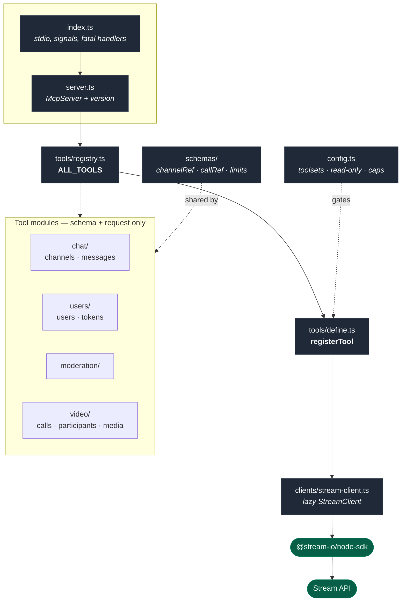
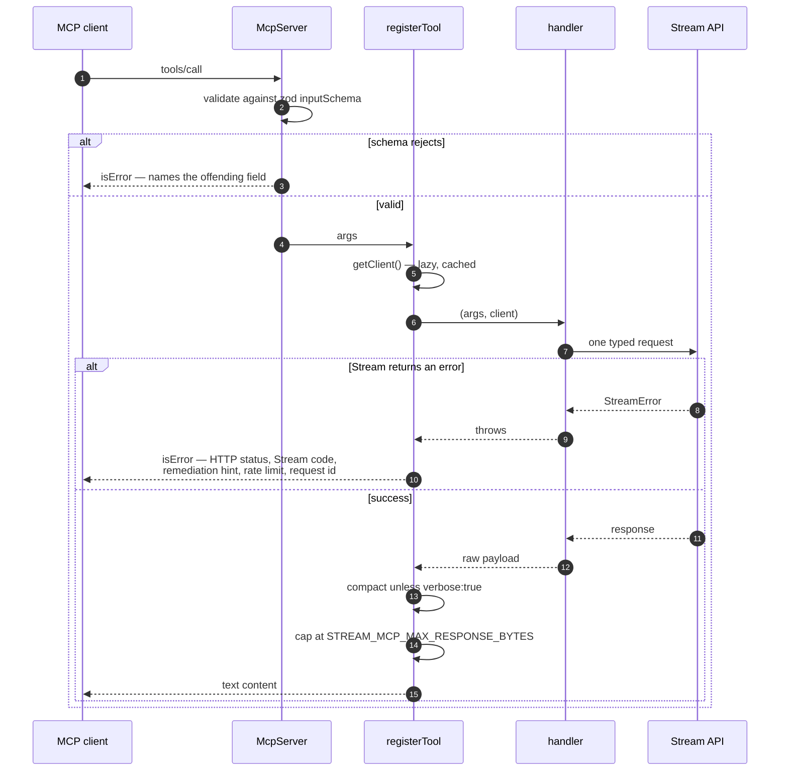
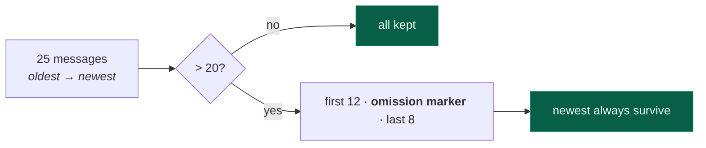

# Unofficial Stream.io MCP Server

An [MCP](https://modelcontextprotocol.io) server that gives an AI assistant deterministic, typed access to the [Stream.io](https://getstream.io) Chat and Video APIs.

**30 tools**, every one explicitly schema-checked against Stream's server-side API. No generic HTTP escape hatch.

> Unofficial and not affiliated with Stream.

## Install

```bash
npx unofficial-streamio-mcp-server
```

Requires **Node 22.12+** at runtime (`@stream-io/node-sdk` 0.8 dropped older versions). Development needs **22.13+**, because ESLint 10 does not support 22.12.

## Configure

Get an API key and secret from the [Stream dashboard](https://dashboard.getstream.io).

**Claude Desktop** — `~/Library/Application Support/Claude/claude_desktop_config.json` on macOS, `%APPDATA%\Claude\claude_desktop_config.json` on Windows:

```json
{
  "mcpServers": {
    "stream-io": {
      "command": "npx",
      "args": ["-y", "unofficial-streamio-mcp-server"],
      "env": {
        "STREAM_API_KEY": "your-api-key",
        "STREAM_API_SECRET": "your-api-secret"
      }
    }
  }
}
```

**Claude Code** — add the same block to `.mcp.json` in your project, or run:

```bash
claude mcp add stream-io -e STREAM_API_KEY=... -e STREAM_API_SECRET=... -- npx -y unofficial-streamio-mcp-server
```

### Environment variables

| Variable                        | Default | Purpose                                                               |
| ------------------------------- | ------- | --------------------------------------------------------------------- |
| `STREAM_API_KEY`                | —       | **Required.** Stream app key.                                         |
| `STREAM_API_SECRET`             | —       | **Required.** Stream app secret. Grants full admin access to the app. |
| `STREAM_MCP_TOOLSETS`           | `all`   | Comma-separated subset of `chat`, `video`, `moderation`, `users`.     |
| `STREAM_MCP_READ_ONLY`          | `false` | Register only tools annotated read-only.                              |
| `STREAM_TIMEOUT_MS`             | `15000` | Request timeout.                                                      |
| `STREAM_MCP_MAX_RESPONSE_BYTES` | `30000` | Cap on a single tool result.                                          |
| `STREAM_BASE_URL`               | —       | Override the Stream API base URL.                                     |

The server starts and lists its tools without credentials, so tool discovery works before setup; individual calls then fail with a clear message.

### Keeping the tool surface small

Two knobs, which matter more as the tool surface grows:

```jsonc
// Only chat + users
"env": { "STREAM_MCP_TOOLSETS": "chat,users" }

// Read-only: nothing that writes. Recommended for production apps.
"env": { "STREAM_MCP_READ_ONLY": "true" }
```

## Safety

The API secret is an **admin credential** for the entire Stream app. This server exposes tools that permanently delete channels, hard-delete messages, ban users, end calls and rewrite app settings.

- Point it at a **development Stream app** unless you specifically need production.
- Use `STREAM_MCP_READ_ONLY=true` against production.
- Destructive tools are annotated `destructiveHint`, so MCP clients that gate on annotations will prompt before running them.

## Tools

| Toolset      | Tools | Covers                                   |
| ------------ | ----- | ---------------------------------------- |
| `chat`       | 8     | Channels, members, messages              |
| `users`      | 3     | User upsert, query, tokens               |
| `moderation` | 3     | Bans, flags                              |
| `video`      | 16    | Calls, members, recording, transcription |

Full per-tool parameter reference (generated from the registry, never hand-edited):

- [docs/chat-tools.md](docs/chat-tools.md) — chat, users, moderation
- [docs/video-tools.md](docs/video-tools.md) — video

Every tool also accepts `verbose: true` to bypass response compaction and return the raw Stream payload.

### Response compaction

Stream responses are large — a `queryChannels` page is mostly channel-type config blobs. By default results are compacted: noisy structural keys (`config`, `own_capabilities`, `grants`, `commands`) are dropped, arrays over 20 items are truncated with a marker, and long strings are trimmed. Pass `verbose: true` when you genuinely need the full payload.

## Not covered

Feeds v3 (`client.feeds`) — out of scope for this package.

Broader coverage of the Chat, Video, Moderation and App APIs (threads, reactions, search, reading message history, call tokens, livestreaming, channel and call types, review queue, blocklists, app settings) lands separately on top of this refactor.

## Architecture

Tools are **data, not functions**. Each one is a `ToolDef` object — a name, a zod schema, annotations, and a handler that builds exactly one Stream request. Everything cross-cutting happens once, in `registerTool`.



`registerTool` is the only place that knows about clients, errors, compaction or gating, which is why a tool module contains nothing but its schema and the request it builds — and why the payload tests can assert that request exactly.

### What happens on a tool call



Three layers catch bad input, in order: the zod schema rejects malformed fields; the handler throws `ToolInputError` for cross-field rules a per-field schema cannot express ("a distinct channel needs 2+ members"); and `formatErrorMessage` unpacks whatever Stream sends back into something a model can act on rather than retry blindly.

### Response compaction

Stream responses are dominated by things nobody asked for — a `queryChannels` page is mostly channel-type config blobs. `shrink()` drops those keys, trims long strings, and cuts oversized arrays **from the middle**:



Trimming the tail would silently hide the most recent messages — the ones a caller reading chat history actually wants. Tools whose list length the caller already bounded with `limit` skip trimming entirely, and `verbose: true` returns the untouched payload.

### Testing

| Layer                        | What it covers                                                                                 |
| ---------------------------- | ---------------------------------------------------------------------------------------------- |
| `registry.test.ts`           | Unique names, valid prefixes and toolsets, annotations present and self-consistent             |
| `server.test.ts`             | A real `Client` over `InMemoryTransport` — the only layer that exercises zod                   |
| `tools/payloads.test.ts`     | Every tool asserted against the **exact** request it builds; fails if a tool has no case       |
| `tools/rejections.test.ts`   | Cross-field rules reject _and_ make no SDK call                                                |
| `integration/*.live.test.ts` | Real Stream API, `mcptest-*` fixtures, teardown via the SDK so a broken tool leaves no residue |

Nothing reads `server["_registeredTools"]` or any other MCP SDK internal.

## Development

```bash
npm install
npm run build
npm test           # unit + MCP round-trip tests, no network
npm run smoke      # boots the built server over stdio and validates tools/list
npm run lint
npm run typecheck
npm run docs:tools # regenerate docs/*-tools.md from the registry
```

### Verifying credentials safely

```bash
STREAM_API_KEY=… STREAM_API_SECRET=… npm run probe
```

Calls every read-only tool against your app and reports what works. It writes
nothing and creates nothing, so it is safe against a production app.

### Live tests

`npm run test:live` drives every tool against a real Stream app through a real MCP client. It creates only `mcptest-*` fixtures and tears them down in `afterAll`.

```bash
cp .env.example .env   # fill in a *scratch* app's key and secret
npm run build && npm run test:live
```

Without `STREAM_API_KEY` the live suites skip rather than fail.

## License

MIT
