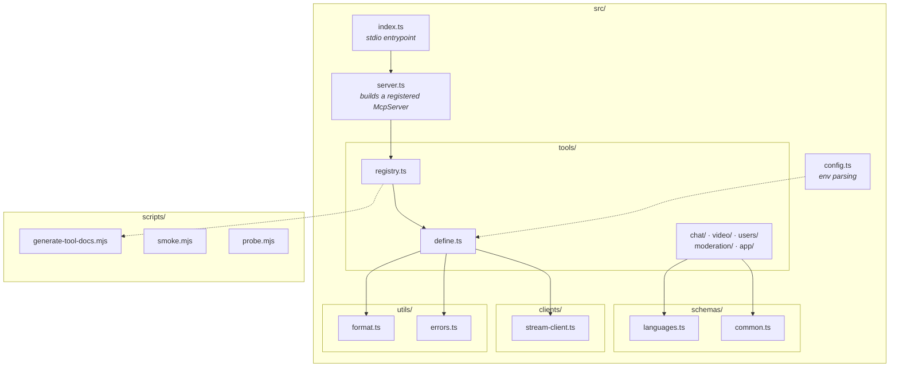
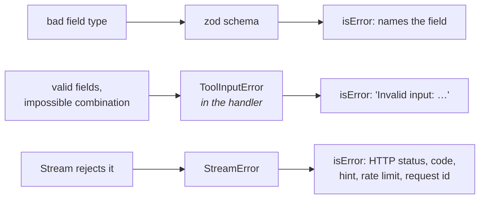

# Architecture

The high-level picture, the request path and the compaction rules are in the
[README](../README.md#architecture). This page covers the layout and the
decisions behind it.

## Layout



## Why tools are data

A `ToolDef` is a plain object: name, title, toolset, zod `inputSchema`,
annotations, and a `handler` that builds one Stream request.

```ts
defineTool({
  name: "video_start_recording",
  toolset: "video",
  annotations: {
    readOnlyHint: false,
    destructiveHint: false,
    idempotentHint: true,
    openWorldHint: true,
  },
  inputSchema: {
    ...callRef,
    recording_type: z.enum(["composite", "individual", "raw"]).optional(),
  },
  handler: async (args, client) =>
    client.video.startRecording({ ...args, recording_type: args.recording_type ?? "composite" }),
});
```

`registerTool` supplies everything else: client lookup, the injected `verbose`
parameter, error mapping, compaction, toolset and read-only gating, and
deprecated aliases. Three consequences worth naming:

- A tool module has no imperative surface to get wrong. The 0.1.0 code repeated
  the same `getClient()` / `try` / `catch` block 29 times.
- `ALL_TOOLS` is introspectable, so tests and the docs generator read the
  registry directly instead of the MCP server's internals.
- Adding a tool is one object. Forgetting to test it fails the build, because
  `payloads.test.ts` asserts full coverage of the registry.

## Error handling



`StreamError` carries `code` and `metadata.{responseCode, rateLimit,
clientRequestId}` — but **not** `status`. Reading `error.status` is why 0.1.0
reported every failure as `Stream API Error (unknown)`.

Common Stream codes are mapped to a one-line remediation hint so a model stops
retrying something unretryable: `4` input error, `9` rate limited, `16` does
not exist, `17` not allowed, `40` auth failed.

## Configuration surface

| Variable                        | Effect                                                                                    |
| ------------------------------- | ----------------------------------------------------------------------------------------- |
| `STREAM_MCP_TOOLSETS`           | Which groups register. Unknown names fail at startup rather than being ignored.           |
| `STREAM_MCP_READ_ONLY`          | Registers only tools annotated `readOnlyHint` — the safe mode for production credentials. |
| `STREAM_TIMEOUT_MS`             | Request timeout. Positive integers only; a fraction would floor to a 0 ms timeout.        |
| `STREAM_MCP_MAX_RESPONSE_BYTES` | Backstop on one tool result, measured in UTF-8 bytes.                                     |
| `STREAM_BASE_URL`               | Overrides the Stream API base URL.                                                        |

Credentials are read lazily, so `tools/list` works before an app is configured
and discovery never depends on valid keys.

## Scripts

| Script               | Purpose                                                                                          |
| -------------------- | ------------------------------------------------------------------------------------------------ |
| `npm run docs:tools` | Regenerates the tool reference from `ALL_TOOLS`. `docs:check` fails CI when it drifts.           |
| `npm run smoke`      | Boots the built server over stdio and validates `tools/list` and both gating modes.              |
| `npm run probe`      | Calls every read-only tool against a live app. Writes nothing, so it is safe against production. |
