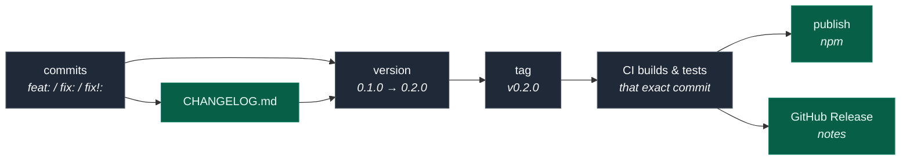
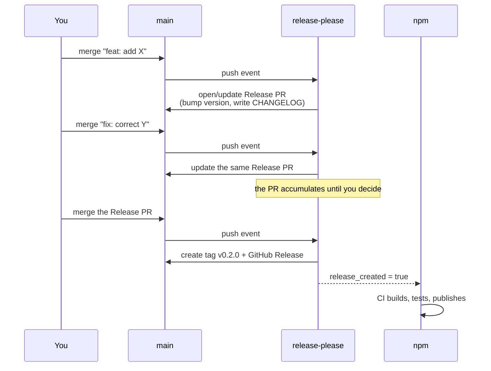

# Release engineering

A reusable framework for versioning, tagging, releasing and publishing a
JavaScript/TypeScript package. Written for this repository, but the shape
transfers to any single-package project.

Every external claim here is linked to its source at the [end](#sources).

---

## 1. The five things people conflate

These are separate concerns with separate artifacts. Most release confusion
comes from treating them as one step.

| Concept       | What it actually is                               | Lives in        | Who owns it            |
| ------------- | ------------------------------------------------- | --------------- | ---------------------- |
| **Version**   | A _promise_ about compatibility                   | `package.json`  | release tooling        |
| **Tag**       | An immutable pointer to the exact released commit | git (`v0.2.0`)  | release tooling        |
| **Release**   | Human-facing notes attached to that tag           | GitHub Releases | release tooling        |
| **Publish**   | Pushing the built tarball to a registry           | npmjs.com       | CI                     |
| **Changelog** | The durable, ordered record of change             | `CHANGELOG.md`  | generated from commits |



The **tag is the hinge**. Everything downstream keys off it, which is why the
tag must point at a commit that CI has actually built and tested — not at
whatever happened to be on your laptop.

---

## 2. Versioning: Semantic Versioning 2.0.0

`MAJOR.MINOR.PATCH`, where each number is a promise to consumers:

| Bump      | When                              | Meaning to a consumer                       |
| --------- | --------------------------------- | ------------------------------------------- |
| **MAJOR** | Incompatible API changes          | "Read the migration notes before upgrading" |
| **MINOR** | Backward-compatible functionality | "Safe to upgrade; there's new stuff"        |
| **PATCH** | Backward-compatible bug fixes     | "Just upgrade"                              |

### The 0.x rule that matters most

> Major version zero (0.y.z) is for initial development. Anything MAY change at
> any time. The public API SHOULD NOT be considered stable.
> — [SemVer 2.0.0, rule 4][semver]

**While you are on 0.x, breaking changes go in a MINOR bump.** This is why this
package went `0.1.0 → 0.2.0` despite renaming tools and raising the Node floor.
It would have been dishonest to call that a patch and premature to call it
`1.0.0`.

Reaching `1.0.0` is a _commitment_, not a milestone. After it, every rename or
removal costs a major version. Do it when the API has stopped moving, not when
the project feels important.

### Pre-releases

`1.0.0-rc.1`, `0.2.0-beta.0`. Pre-release versions sort _below_ their release
([rule 9 and 11][semver]), so `0.2.0-rc.1 < 0.2.0`. Pair them with a dist-tag
(§6) or they will be installed by everyone.

---

## 3. Conventional Commits: the input to everything

If commit messages are structured, the version, changelog and release notes can
all be derived rather than hand-maintained. That removes an entire class of
drift — including the kind where a README advertises 118 tools and the code has 30.

```
<type>[optional scope][!]: <description>

[optional body]

[optional footer(s)]
```

| Type                                                      | Meaning                                | Version effect              |
| --------------------------------------------------------- | -------------------------------------- | --------------------------- |
| `feat`                                                    | New feature                            | **MINOR**                   |
| `fix`                                                     | Bug fix                                | **PATCH**                   |
| `perf`                                                    | Performance improvement                | PATCH                       |
| `refactor`                                                | Neither fixes a bug nor adds a feature | none                        |
| `docs`, `test`, `build`, `ci`, `chore`, `style`, `revert` | Supporting work                        | none                        |
| any type with `!` or a `BREAKING CHANGE:` footer          | Incompatible change                    | **MAJOR** (MINOR while 0.x) |

Two ways to declare a break ([spec][cc]):

```
feat!: drop Node 20 support

fix: correct token expiry

BREAKING CHANGE: tokens now default to 1h instead of 24h
```

> A BREAKING CHANGE can be part of commits of any type.
> — [Conventional Commits v1.0.0][cc]

**Practical advice.** The subject line is what lands in the changelog, so write
it for the person deciding whether to upgrade — not for yourself. `fix: correct
recording_type path segment` is useful; `fix: bug` is not.

---

## 4. Choosing release automation

Four common tools, and the axis that actually separates them: **who decides
when to release.**

| Tool                    | Trigger                        | Gate                         | Best when                                   |
| ----------------------- | ------------------------------ | ---------------------------- | ------------------------------------------- |
| **release-please**      | Conventional commits on `main` | You merge a Release PR       | You want automation _and_ an approval step  |
| **semantic-release**    | Every qualifying merge         | None — publishes immediately | Trunk-based, high-frequency, low-ceremony   |
| **Changesets**          | A changeset file per PR        | You merge a Version PR       | Monorepos; teams wanting hand-written notes |
| **release-it** / manual | You run a command              | You, at the keyboard         | Small projects, infrequent releases         |

> Release Please, created by Google, takes a different approach by creating and
> maintaining release pull requests based on conventional commits, allowing you
> to review and approve every release.
> — [Oleksii Popov, NPM release automation][releaseauto]

### Why this repo uses release-please

1. The commit history **already** follows Conventional Commits, so it needed no
   new discipline.
2. Releases stay **batched and reviewable** — the Release PR accumulates changes
   and you merge it when the set is coherent, rather than shipping on every
   merge.
3. The changelog is **generated**, so it cannot drift from the code.
4. The Release PR is editable before merging, so generated notes can be enriched
   with the _why_ that commit subjects don't carry.

### How it behaves



The config in this repo (`release-please-config.json`):

```jsonc
{
  "release-type": "node",
  "include-v-in-tag": true,
  // While < 1.0.0, a breaking change bumps MINOR, not MAJOR.
  "bump-minor-pre-major": true,
  // ...and `feat` still bumps MINOR rather than being demoted to PATCH.
  "bump-patch-for-minor-pre-major": false,
}
```

`.release-please-manifest.json` records the current version. Bootstrap it to
the **last published version**, not the next one — release-please computes the
next itself from the commits since that point.

---

## 5. Publishing: trusted publishing over tokens

This is the part that changed most recently, and the old advice is now the
wrong advice.

### The old way (avoid for new setups)

Create a long-lived npm access token, store it as `NPM_TOKEN`, and have CI use
it. It works, but the token is a durable credential sitting in your repo
settings: it must be rotated by hand, and anyone able to modify a workflow can
exfiltrate it.

### The current way: OIDC trusted publishing

npm trusted publishing [went GA in July 2025][ghchangelog]. CI proves its
identity with a short-lived OpenID Connect token instead of a stored secret.

> Trusted publishing eliminates token security risks by removing the need to
> store, rotate, or expose npm tokens in CI/CD environments, instead using
> short-lived, workflow-specific credentials that cannot be exfiltrated or
> reused.
> — [codenote.net][hardening]

**Requirements** ([npm docs][trustedpub]):

- npm CLI **11.5.1+**, Node **22.14.0+**
- `id-token: write` permission on the publishing job
- A trusted publisher configured on npmjs.com naming the org, repo, and
  **workflow filename**
- A cloud-hosted runner (self-hosted runners are not supported)

**One-time manual setup** — this cannot be automated, because it is the step
that establishes trust:

1. npmjs.com → your package → **Settings** → **Trusted Publisher**
2. Select **GitHub Actions**, then enter:
   - Organization/user: `teetangh`
   - Repository: `unofficial-streamio-mcp-server`
   - Workflow filename: `release.yml` _(filename only, with extension)_
   - Environment: leave blank unless you use GitHub Environments
3. Allowed actions: select `npm publish`

> Trusted publisher configurations created before May 20, 2026 are automatically
> set to allow `npm publish` only. Configurations created after May 20, 2026
> require you to explicitly select at least one allowed action.
> — [npm docs][trustedpub]

### Two traps that produce a misleading error

**`setup-node`'s `registry-url` breaks OIDC.** Setting it makes the action
write an `.npmrc` containing:

```
//registry.npmjs.org/:_authToken=${NODE_AUTH_TOKEN}
```

That is correct for classic token auth. With trusted publishing there is no
token, so the placeholder expands to empty, npm takes the classic-auth path,
never performs the OIDC handshake, and the registry treats the request as
anonymous. Anonymous users cannot `PUT`, so you get:

```
npm error 404 Not Found - PUT https://registry.npmjs.org/<package>
npm error 404 The requested resource '<package>@<version>' could not be
found or you do not have permission to access it.
```

The 404 is misleading — npm masks 401/403 as 404 so the registry does not leak
which packages exist. **Omit `registry-url` entirely** when publishing via
OIDC. Tracked as [actions/setup-node#1551][setupnode1551].

**Node 22 ships npm 10.** Trusted publishing needs npm ≥ 11.5.1, so a
`node-version: 22` job silently falls back to token auth. Use Node 24, or
install a new enough npm explicitly.

A defensive check worth adding before `npm publish`:

```yaml
- name: Verify no token-based auth is configured
  run: |
    if npm config get //registry.npmjs.org/:_authToken | grep -qv '^undefined$'; then
      echo "An _authToken is configured; npm will use classic auth instead of OIDC." >&2
      exit 1
    fi
```

### Always give yourself a republish path

A publish can fail for reasons unrelated to the code — a misconfigured trusted
publisher, a registry outage, an expired setting. If publishing is only
triggered by "a release PR was merged", recovering means cutting a new version
for no reason.

Add a manual trigger that republishes the current default branch:

```yaml
on:
  push:
    branches: [main]
  workflow_dispatch:
    inputs:
      publish:
        description: Publish the current main to npm
        type: boolean
        default: false
```

```yaml
if: >-
  needs.release-please.outputs.release_created == 'true' ||
  (github.event_name == 'workflow_dispatch' && inputs.publish)
```

The tag and GitHub Release already exist and point at the right commit, so a
retry publishes the same artifact without touching the version.

### Provenance comes free

> When you publish using trusted publishing from GitHub Actions or GitLab CI/CD,
> npm automatically generates and publishes provenance attestations... The
> `--provenance` flag is no longer needed.
> — [npm docs][trustedpub]

A provenance attestation is a signed, publicly logged statement linking the
published tarball to the exact commit and workflow run that produced it. It is
signed via [Sigstore][provenance] and recorded in a transparency log — a public,
tamper-evident ledger. npm shows a **verified** badge on the package page, and
consumers can check their whole tree with:

```bash
npm audit signatures
```

**What it does not do:** provenance proves _where a package came from_, not that
the code is safe. Per npm's docs, it "does not guarantee the package has no
malicious code."

Requirements for provenance ([npm docs][provenance]): public repository, public
package, `repository` field in `package.json` matching the publishing location
(case-sensitive), and a supported cloud CI.

---

### Do I need `npm login` on every machine?

No — and that is the point. With CI publishing, **no human ever runs
`npm publish`**, so no developer machine needs npm credentials at all. A fresh
laptop needs `git` and `npm ci`; publishing rights live entirely in the
repository/workflow identity that npm was told to trust.

`npm login` is only needed if you publish by hand, which this setup exists to
avoid. Avoiding it also removes the "works on my machine" release: the artifact
is always built on a clean runner from a tagged commit.

## 6. Dist-tags: how npm decides what "install" means

`npm install pkg` resolves to whatever the **`latest`** dist-tag points at.
Tags are mutable labels on immutable versions.

```bash
npm dist-tag ls pkg              # what tags exist
npm publish --tag next           # publish WITHOUT moving `latest`
npm dist-tag add pkg@0.2.0 latest   # promote later
```

**The trap:** publishing a pre-release without `--tag` still moves `latest`.

> When you `npm publish` a new version of your package, unless you specify
> otherwise, the new version will get the `latest` tag, even if it's a
> prerelease version. This is bad, because... `npm install` will default to the
> `latest` tag, meaning they'd get your prerelease version.
> — [Cloud Four][cloudfour]

This matters here specifically: `familiarise_web/.mcp.json` runs
`npx -y unofficial-streamio-mcp-server@latest`, so whatever holds `latest`
is what that project resolves on every start.

If you publish a pre-release to `latest` by mistake, fix it by pointing `latest`
back at the last good version with `npm dist-tag add`.

---

## 7. What to update, and what updates itself

| Artifact                 | Who updates it               | Why                              |
| ------------------------ | ---------------------------- | -------------------------------- |
| `package.json` version   | release-please               | Single source of truth           |
| `CHANGELOG.md`           | release-please, from commits | Cannot drift from the code       |
| Git tag + GitHub Release | release-please               | Tied to the reviewed commit      |
| npm package              | CI, on tag                   | Built and tested before it ships |
| **README**               | **You, in the feature PR**   | Nothing derives prose from code  |

**README is the one that rots.** Nothing generates it, so it drifts silently —
which is exactly what happened here when the README advertised 118 tools while
the branch shipped 30.

Two defences, both used in this repo:

1. **Generate what can be generated.** `npm run docs:tools` builds the per-tool
   reference from the registry, and `npm run docs:check` fails CI when the
   committed docs no longer match. Drift becomes a build error.
2. **Treat counts as code.** Anything numeric in prose (tool counts, toolset
   tables) should be regenerated, not retyped.

---

## 8. The full pipeline in this repo

Two workflows with distinct jobs:

**`ci.yml`** — runs on every push and _every_ pull request:
lint → format check → typecheck → build → unit tests → docs freshness → MCP
stdio smoke test. Node 22 and 24.

> Note: `pull_request` with no `branches:` filter is deliberate. Filtering to
> `[main]` silently skips **stacked PRs** — a PR based on another feature branch
> gets no checks at all and can merge unverified.

**`release.yml`** — runs on push to `main`:

```yaml
jobs:
  release-please: # opens/updates the Release PR, or tags on merge
  publish: # only when release_created == true
    permissions:
      id-token: write # OIDC; without this, npm looks for a token
    steps:
      - npm ci && npm run lint && npm run typecheck
      - npm run build && npm test && npm run docs:check && npm run smoke
      - npm publish # no NPM_TOKEN
```

The publish job **re-runs the whole verification suite** on the tagged commit.
That is not redundant with CI: it guarantees the artifact reaching npm was built
from exactly the commit that was tagged, on a clean runner.

### Doing a release

1. Merge feature/fix PRs to `main` with conventional commit subjects.
2. release-please keeps a Release PR up to date. Review its `CHANGELOG.md` diff
   and edit if the generated notes need context.
3. Merge the Release PR. Tag, GitHub Release and npm publish happen automatically.
4. Verify: `npm view unofficial-streamio-mcp-server version` and check the
   provenance badge on the package page.

### Rolling back

You cannot meaningfully unpublish (npm restricts it, and consumers may have
cached it). Instead:

```bash
npm dist-tag add unofficial-streamio-mcp-server@0.1.0 latest   # stop the bleeding
# then fix forward with a new patch release
```

`npm deprecate pkg@0.2.0 "message"` warns anyone installing the bad version.

---

## 9. Checklist for a new project

- [ ] Adopt Conventional Commits from the first commit
- [ ] Add `release-please-config.json` + `.release-please-manifest.json`,
      bootstrapped to the last published version (or `0.0.0`)
- [ ] Set `bump-minor-pre-major: true` while under 1.0.0
- [ ] `ci.yml` on every push **and every PR** (no `branches:` filter)
- [ ] `release.yml` with `id-token: write` and no `NPM_TOKEN`
- [ ] Configure the trusted publisher on npmjs.com (manual, one-time)
- [ ] Ensure `repository` in `package.json` matches the repo, for provenance
- [ ] Set `files` in `package.json` so only build output ships
- [ ] Generate whatever docs can be generated; fail CI when they drift
- [ ] Decide the `1.0.0` criteria in advance and write them down

---

## Sources

- [Semantic Versioning 2.0.0][semver] — versioning rules, 0.x behaviour, pre-release precedence
- [Conventional Commits v1.0.0][cc] — commit format, types, breaking-change notation
- [npm: Trusted publishing][trustedpub] — OIDC setup, requirements, allowed actions, automatic provenance
- [GitHub Changelog: npm trusted publishing with OIDC is GA][ghchangelog] — July 2025 general availability
- [npm: Generating provenance statements][provenance] — attestation contents, Sigstore, transparency log, `npm audit signatures`
- [npm: Adding dist-tags to packages][disttags] — dist-tag mechanics
- [Cloud Four: How to prerelease an npm package][cloudfour] — the `latest` dist-tag trap
- [Hardening npm publishing with trusted publishing][hardening] — threat model for tokens vs OIDC
- [The Ultimate Guide to NPM Release Automation][releaseauto] — semantic-release vs release-please vs Changesets
- [release-please-action][rpaction] — the GitHub Action used here
- [actions/setup-node#1551][setupnode1551] — `registry-url` writes an `_authToken` line that breaks OIDC

[semver]: https://semver.org/
[cc]: https://www.conventionalcommits.org/en/v1.0.0/
[trustedpub]: https://docs.npmjs.com/trusted-publishers/
[ghchangelog]: https://github.blog/changelog/2025-07-31-npm-trusted-publishing-with-oidc-is-generally-available/
[provenance]: https://docs.npmjs.com/generating-provenance-statements
[disttags]: https://docs.npmjs.com/adding-dist-tags-to-packages/
[cloudfour]: https://cloudfour.com/thinks/how-to-prerelease-an-npm-package/
[hardening]: https://codenote.net/en/posts/npm-trusted-publishing-oidc-staged-hardened-release/
[releaseauto]: https://oleksiipopov.com/blog/npm-release-automation/
[rpaction]: https://github.com/googleapis/release-please-action
[setupnode1551]: https://github.com/actions/setup-node/issues/1551
